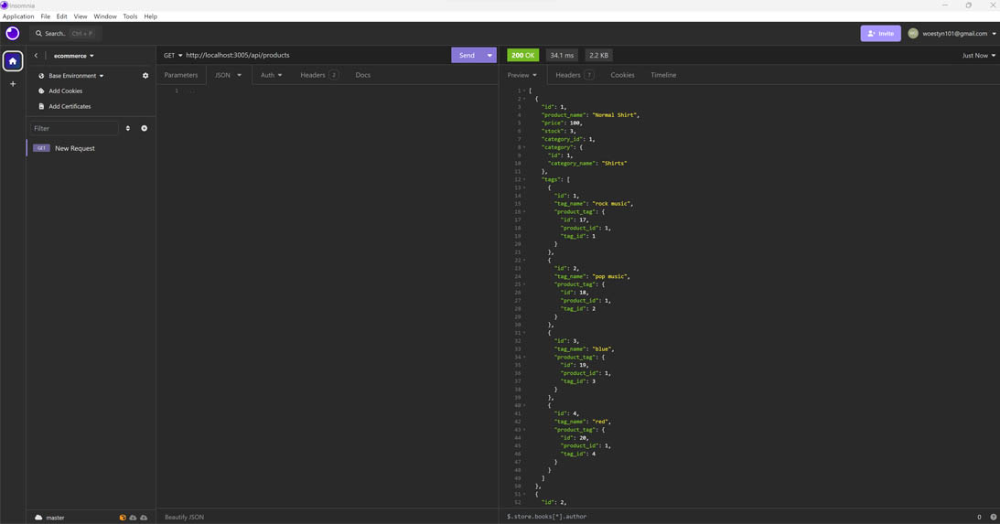

#  e-commerce app

## Description

This project challenged me to use a mysql database 
and interact with it using node.js and the sequelize package.

During this project I learned how to:

- create a mysql database.
- make a connection with the database.
- create Models and seed it with data.
- use mysql workbench
- use the mysql2 package.
- use sequelize to run CRUD operations.
- use Insomnia to test the database.
- set up routes with express

## Table of Contents:

[Installation](#Installation)
[Video Link](#video)
[Usage](#usage)
[Credits](#credits)
[License](#license)

## Installation 

 Clone repository to local machine
- run npm install
- To start the progam run: node injex.js
- to create database with tables/models
- to fill models with data: npm run seed 
- creata a .env files with your credentials for
- DB_NAME, DB_PW, DB_USER
- use Insomnia to run CRUD operations on routes.
  
## Video

https://drive.google.com/file/d/1wnwqNXqbFcw0-7IS5ksbhcvEcwnGEOuQ/view?usp=sharing

## Usage

This app provides an easy and accessible way for a for a business owner to view and manage the categories, products and tags for a company's inventory.

## Screenshot of app

## Credits: Resources used

I used and modified code from the following resources:

https://sequelize.org/docs/v6/core-concepts/model-basics/

https://www.youtube.com/watch?v=YNyGD4rakmc&list=PLkqiWyX-_Lov8qmMOVn4SEQwr9yOjNn3f

https://stackoverflow.com/questions/73798993/how-to-adding-default-value-to-sequelize-model-with-nodejs

## License

MIT
